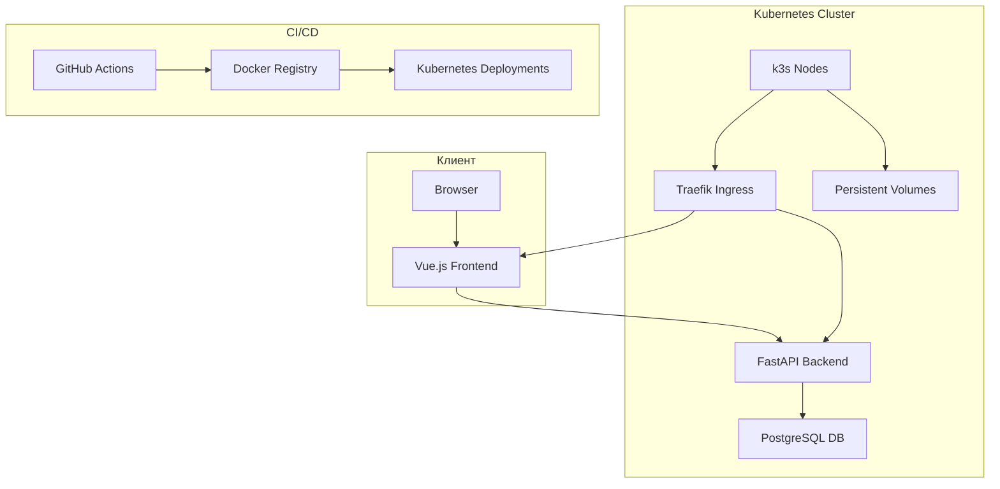
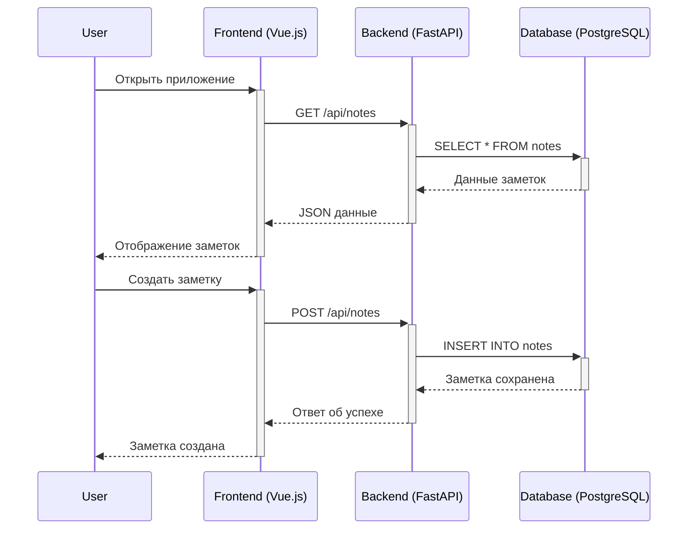

# Архитектура микросервисного приложения заметок

## Общая архитектура

## Взаимодействие между сервисами

## Безопасность и доступ

- DNS: serv.temasuug.ru
- HTTPS: Обеспечен через Traefik + Let's Encrypt
- Аутентификация: JWT токены
- Сетевая изоляция: NetworkPolicies